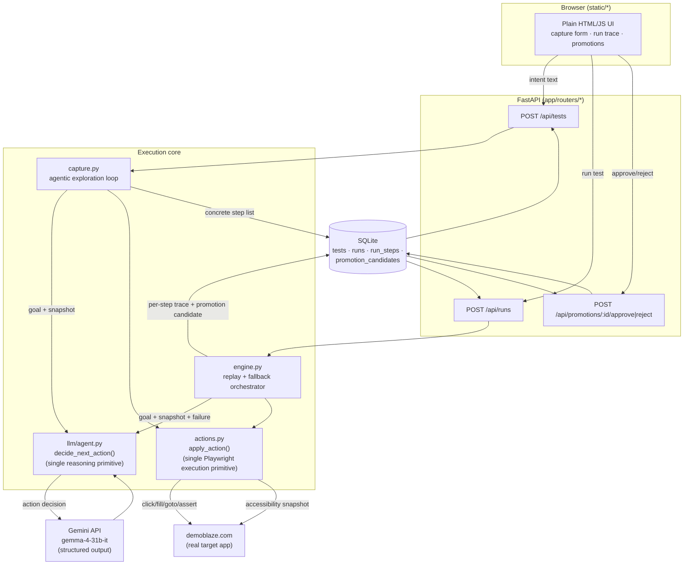

# Architecture — Hybrid Test Execution Prototype



## The one idea this diagram is trying to make obvious

**`decide_next_action()` and `apply_action()` are each called from two
places, not duplicated for "agentic" vs "deterministic."**

- `apply_action()` is the only code that touches Playwright. Capture-time
  exploration and deterministic replay both call it — "deterministic
  execution" is just this function running with a selector nobody reasoned
  about this time.
- `decide_next_action()` is the only code that calls the LLM. Capture-time
  exploration and runtime recovery both call it — recovery isn't a bolted-on
  fallback path, it's the same capability the system already needed to
  author the test in the first place.

## The three execution modes, mapped to code

| Mode | Where it lives |
|---|---|
| Deterministic | `engine.py` calling `apply_action()` directly with a stored step |
| Deterministic-with-fallback | `engine.py`: `apply_action()` raises → `decide_next_action()` → `apply_action()` again with the recovered action |
| Agentic-primary | `capture.py`: the whole loop is `decide_next_action()` → `apply_action()`, repeated until the agent says `done` |

## The promotion lifecycle

```
agentic recovery succeeds
        │
        ▼
run_steps row (mode=agentic, reasoning, new selector)
        │
        ▼
promotion_candidates row (status=pending)
        │
   human reviews in UI
        │
   ┌────┴────┐
   ▼         ▼
approve    reject
   │         │
   ▼         └─ status=rejected, canonical script unchanged
tests.steps_json rewritten for that step_uuid
   │
   ▼
next run of that step is deterministic again
```

## Deliberate simplifications (see README "Notes on scope" for the reasoning)

- One shared browser session per run, not a pooled/long-lived one.
- Runs execute synchronously; no WebSocket/live streaming.
- SQLite accessed synchronously, no async driver.
- Selector-repair fallback in `actions.py` exists because prompt compliance
  alone isn't a reliable contract across models of different capability —
  a defensive layer, not a substitute for prompt design.
